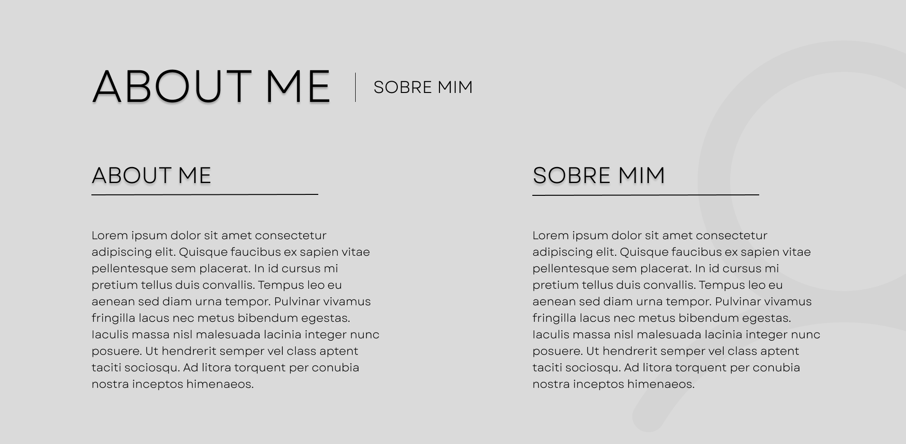
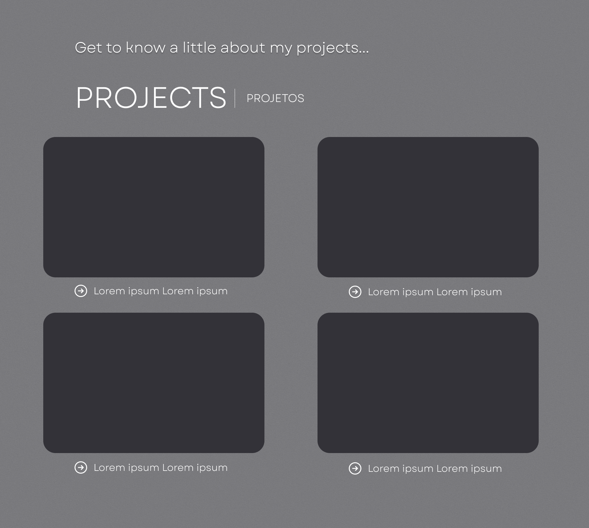
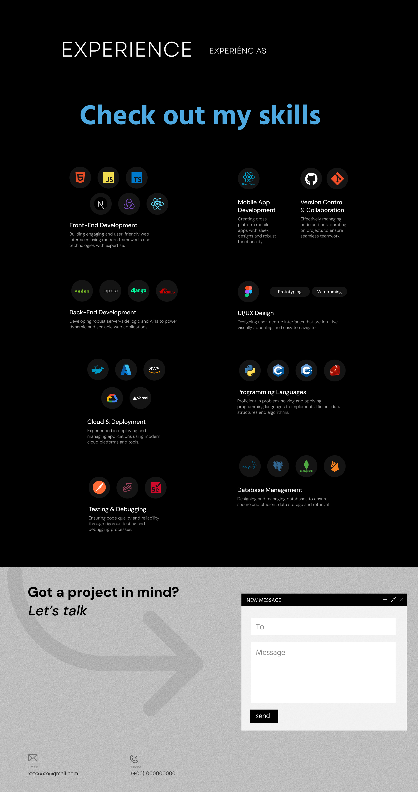
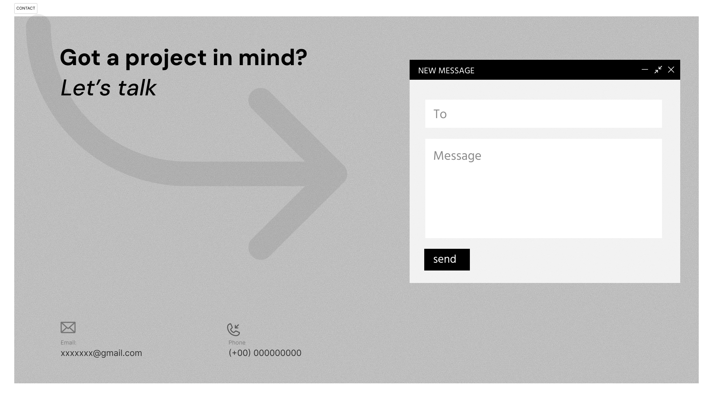

# DevPortfolio

## Sobre o projeto

O **DevPortfolio** é um projeto de portfólio pessoal desenvolvido para apresentar informações profissionais, habilidades técnicas, experiências e projetos de um desenvolvedor de software.

O projeto parte de um **wireframe de alta fidelidade desenvolvido no Figma**, que será utilizado como referência para a implementação do front-end.

A proposta é transformar o protótipo visual em uma aplicação web funcional, responsiva e com navegação entre suas principais seções.

O desenvolvimento será realizado utilizando **React com TypeScript**, com o **Vite** como ferramenta de construção e execução do projeto.

---

## Integrantes

- Antônio Rabelo
- Diogo Augusto
- João Pedro Bomfim
- Sophia Melo 

---

## Wireframe

O wireframe foi desenvolvido para definir previamente a estrutura visual, a organização das informações e a navegação do portfólio.

A partir dele, será desenvolvido o protótipo inicial do front-end.

### Página inicial e Sobre Mim



A primeira parte do wireframe apresenta a identidade visual principal do portfólio.

Nessa seção serão implementados:

- Área de apresentação;
- Imagem do desenvolvedor;
- Identificação profissional;
- Menu de navegação;
- Seção "Sobre Mim";
- Breve descrição profissional;
- Informações sobre o perfil e área de atuação.

A página inicial terá como objetivo apresentar rapidamente o desenvolvedor e direcionar o visitante para as demais áreas do portfólio.

---

### Projetos



A seção **Projetos** será utilizada para apresentar os principais trabalhos desenvolvidos.

Os projetos serão organizados em cards para facilitar a visualização.

Cada card poderá apresentar:

- Imagem ou capa do projeto;
- Nome do projeto;
- Breve descrição;
- Tecnologias utilizadas;
- Link para o GitHub;
- Link para demonstração do projeto, quando disponível.

A organização em cards permitirá adicionar novos projetos futuramente sem alterar significativamente a estrutura da página.

---

### Experiência e Habilidades



A seção de **Experiência e Habilidades** terá como objetivo apresentar as principais competências técnicas do desenvolvedor.

Entre os elementos previstos estão:

- Experiências profissionais;
- Desenvolvimento Front-end;
- Desenvolvimento Back-end;
- Desenvolvimento Mobile;
- Cloud e Deploy;
- Banco de Dados;
- Controle de Versão;
- UI/UX Design;
- Linguagens de Programação;
- Testes e Debugging.

As tecnologias serão organizadas por categorias e poderão ser representadas utilizando ícones, tornando a apresentação mais visual e fácil de compreender.

---

### Contato



A seção **Contato** será utilizada para permitir que visitantes entrem em contato com o desenvolvedor.

O formulário contará inicialmente com:

- Nome;
- E-mail;
- Mensagem;
- Botão de envio.

Também poderão ser adicionados links para redes profissionais e plataformas como GitHub e LinkedIn.

---

# Estrutura do projeto

A estrutura inicial do projeto será organizada utilizando componentes e páginas independentes.

```text
devportfolio/
│
├── public/
│   └── images/
│
├── src/
│   │
│   ├── assets/
│   │   ├── images/
│   │   └── icons/
│   │
│   ├── components/
│   │   ├── Header/
│   │   ├── Footer/
│   │   ├── ProjectCard/
│   │   ├── SkillCard/
│   │   └── ContactForm/
│   │
│   ├── pages/
│   │   ├── Home/
│   │   ├── About/
│   │   ├── Projects/
│   │   ├── Experience/
│   │   └── Contact/
│   │
│   ├── App.tsx
│   ├── main.tsx
│   └── styles/
│
├── wireframes/
│   ├── 01-home-sobre.png
│   ├── 02-projetos.png
│   ├── 03-experiencia-habilidades.png
│   └── 04-contato.png
│
├── .gitignore
├── package.json
├── README.md
└── vite.config.ts
