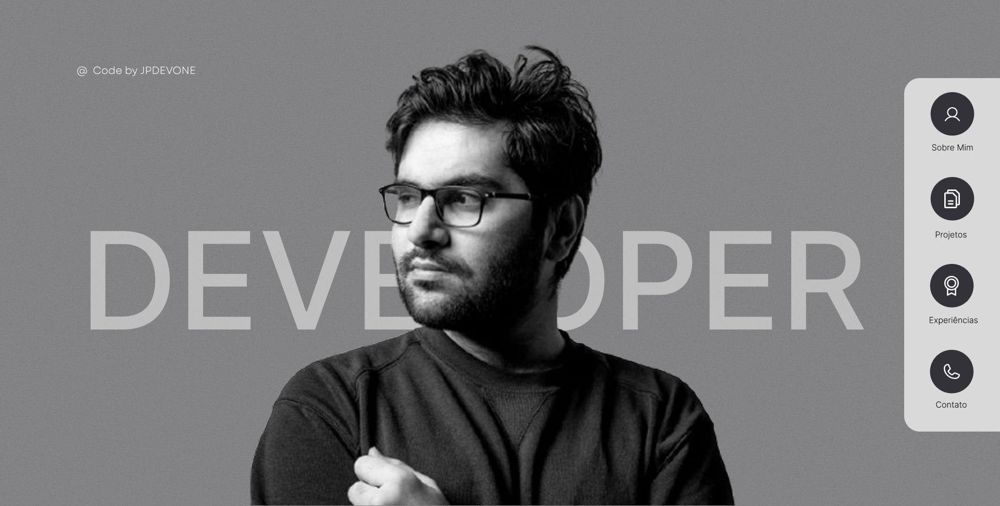

# DevPortfolio

## Sobre o projeto

O **DevPortfolio** é um projeto de portfólio pessoal desenvolvido para apresentar informações profissionais, habilidades técnicas, experiências e projetos de um desenvolvedor de software.

O projeto parte de um **wireframe de alta fidelidade desenvolvido no Figma**, utilizado como referência para a implementação do front-end.

A proposta é transformar o protótipo visual em uma aplicação web funcional, responsiva e com navegação entre suas principais seções.

O desenvolvimento foi realizado utilizando **HTML5, CSS3 e JavaScript**, buscando reproduzir a identidade visual definida no wireframe e proporcionar uma boa experiência de navegação ao usuário.

---

## Integrantes

- Antônio Rabelo
- Diogo Augusto
- João Pedro Bomfim
- Sofia Melo

---

# Tecnologias utilizadas

O projeto foi desenvolvido utilizando tecnologias web nativas:

- **HTML5** — utilizada para estruturação das páginas e conteúdos;
- **CSS3** — utilizada para estilização, layout, responsividade e animações;
- **JavaScript** — utilizado para implementação das funcionalidades e interações da aplicação;
- **Git** — utilizado para controle de versão;
- **GitHub** — utilizado para armazenamento do código e colaboração entre os integrantes;
- **Vercel** — utilizada para hospedagem e publicação da aplicação.

---

# Wireframe

O wireframe foi desenvolvido para definir previamente a estrutura visual, a organização das informações e a navegação do portfólio.

A partir dele, foi desenvolvido o front-end da aplicação, buscando manter a identidade visual e a organização definidas no protótipo.

## Página inicial e Sobre Mim




A primeira parte do wireframe apresenta a identidade visual principal do portfólio.

Nessa seção foram implementados:

- Área de apresentação;
- Imagem do desenvolvedor;
- Identificação profissional;
- Menu de navegação;
- Seção "Sobre Mim";
- Breve descrição profissional;
- Informações sobre o perfil e área de atuação.

A página inicial tem como objetivo apresentar rapidamente o desenvolvedor e direcionar o visitante para as demais áreas do portfólio.

---

## Projetos


A seção **Projetos** é utilizada para apresentar os principais trabalhos desenvolvidos.

Os projetos são organizados em cards para facilitar a visualização e permitir que novos projetos sejam adicionados futuramente.

Cada projeto pode apresentar:

- Imagem ou capa do projeto;
- Nome do projeto;
- Breve descrição;
- Tecnologias utilizadas;
- Link para o GitHub;
- Link para demonstração do projeto, quando disponível.

### Projetos em execução

Também foram utilizadas imagens e demonstrações dos projetos para apresentar visualmente suas interfaces e funcionamento.

Exemplo:

```markdown

```

Os GIFs e imagens permitem visualizar algumas das funcionalidades e interações dos projetos apresentados no portfólio.

---

## Experiência e Habilidades


A seção de **Experiência e Habilidades** tem como objetivo apresentar as principais competências técnicas do desenvolvedor.

Entre os elementos apresentados estão:

- Experiências profissionais;
- Desenvolvimento Front-end;
- Desenvolvimento Back-end;
- Desenvolvimento Mobile;
- Cloud e Deploy;
- Banco de Dados;
- Controle de Versão;
- UI/UX Design;
- Linguagens de Programação;
- Testes e Debugging.

As tecnologias são organizadas por categorias e representadas utilizando elementos visuais e ícones, tornando a apresentação mais visual e fácil de compreender.

---

## Contato


A seção **Contato** permite que visitantes entrem em contato com o desenvolvedor.

O formulário conta com:

- Nome;
- E-mail;
- Mensagem;
- Botão de envio.

Também são disponibilizados links para plataformas profissionais, como:

- GitHub;
- LinkedIn;
- E-mail.

---

# Ajustes visuais e de usabilidade

Durante a implementação do projeto, foram realizados ajustes visuais e de usabilidade para transformar o wireframe em uma aplicação funcional e proporcionar uma melhor experiência ao usuário.

Um dos principais focos dos ajustes foi a **responsividade da aplicação**, garantindo que o portfólio pudesse ser utilizado adequadamente em diferentes tamanhos de tela e dispositivos.

Entre os principais ajustes realizados estão:

- Implementação de layout responsivo;
- Adaptação da interface para computadores, tablets e smartphones;
- Ajustes de espaçamento e alinhamento dos elementos;
- Redimensionamento e reorganização dos componentes em telas menores;
- Ajustes de imagens para diferentes resoluções;
- Adequação dos textos e elementos visuais para dispositivos móveis;
- Ajustes nos botões e links;
- Melhoria na navegação entre as seções;
- Organização dos projetos em cards;
- Ajustes de fontes e tamanhos;
- Melhoria na legibilidade dos conteúdos;
- Implementação de efeitos de interação;
- Implementação de animações;
- Ajustes de posicionamento dos elementos da interface.

Essas alterações foram realizadas buscando manter a identidade visual definida no wireframe, ao mesmo tempo em que a aplicação fosse adaptada para diferentes dispositivos e tamanhos de tela.

---

# Demonstração do projeto

## Página inicial


A página inicial apresenta o desenvolvedor e fornece acesso às principais seções do portfólio.

---

## Sobre Mim


A seção apresenta informações sobre o perfil profissional, formação e área de atuação.

---

## Projetos


A seção apresenta os projetos desenvolvidos, suas tecnologias e links relacionados.

---

## Experiência e Habilidades


A seção apresenta as experiências e principais tecnologias e habilidades utilizadas.

---

## Contato


A seção disponibiliza um formulário para contato e links para plataformas profissionais.

---

# Hospedagem e Deploy

O projeto foi preparado para execução em ambiente de produção e foi publicado utilizando a plataforma **Vercel**.

A Vercel foi utilizada para realizar a hospedagem da aplicação, permitindo que o portfólio pudesse ser acessado diretamente pela internet.

## Site publicado

🌐 **Acesse o DevPortfolio:**

**[INSIRA AQUI O LINK DO SITE PUBLICADO]**

Exemplo:

```text
https://seu-portfolio.vercel.app
```

O deploy possibilita acessar a versão final do portfólio diretamente pelo navegador, sem a necessidade de executar o projeto localmente.

---

# Processo de Deploy

O processo de publicação do projeto foi realizado utilizando o repositório do GitHub integrado à Vercel.

As principais etapas foram:

1. Desenvolvimento e testes da aplicação localmente;
2. Versionamento do projeto utilizando Git;
3. Envio do código para o GitHub;
4. Integração do repositório com a Vercel;
5. Configuração do projeto para hospedagem;
6. Publicação da aplicação;
7. Testes da aplicação após o deploy.

Após a integração, alterações enviadas ao repositório podem ser utilizadas para gerar novas versões da aplicação.

---

# Instruções de uso e desenvolvimento

## Como utilizar o projeto

Para utilizar o DevPortfolio localmente, siga os passos abaixo.

### 1. Clonar o repositório

```bash
git clone URL_DO_REPOSITORIO
```

### 2. Acessar a pasta do projeto

```bash
cd devportfolio
```

### 3. Abrir o projeto

Após clonar o repositório, abra o arquivo:

```text
index.html
```

em um navegador de sua preferência.

Como o projeto foi desenvolvido utilizando **HTML, CSS e JavaScript**, não é necessário instalar dependências ou utilizar comandos como `npm install` ou `npm run dev`.

---

## Como contribuir com o desenvolvimento

Para realizar alterações no projeto:

1. Clone o repositório;
2. Acesse a pasta do projeto;
3. Crie uma nova branch para a alteração;
4. Realize as modificações nos arquivos HTML, CSS ou JavaScript;
5. Abra o arquivo `index.html` no navegador para verificar as alterações;
6. Teste as funcionalidades implementadas;
7. Verifique a responsividade em diferentes tamanhos de tela;
8. Verifique se as alterações não afetaram outras partes do portfólio;
9. Adicione as alterações ao Git;
10. Realize um commit;
11. Envie a branch para o GitHub.

### Criar uma nova branch

```bash
git checkout -b nome-da-branch
```

### Adicionar as alterações

```bash
git add .
```

### Realizar um commit

```bash
git commit -m "feat: descrição da alteração"
```

### Enviar a branch para o GitHub

```bash
git push origin nome-da-branch
```

---

# Estrutura do projeto

A estrutura do projeto é organizada utilizando arquivos HTML, CSS, JavaScript, imagens e demais recursos necessários para o funcionamento do portfólio.

```text
devportfolio/
│
├── imagens/
│   ├── CAPAHOME.png
│   ├── ABOUTME1.png
│   ├── PROJECTS.png
│   ├── EXPERIENCE.png
│   ├── CONTACT.png
│   ├── home.png
│   ├── about.png
│   ├── projects.png
│   ├── experience.png
│   └── contact.png
│
├── assets/
│   ├── images/
│   └── icons/
│
├── index.html
├── style.css
├── script.js
├── .gitignore
└── README.md
```

---

# Organização dos arquivos

## `index.html`

Arquivo responsável pela estrutura e organização dos elementos da aplicação.

Nele estão definidos os principais conteúdos e seções do portfólio.

## `style.css`

Arquivo responsável pela estilização da aplicação.

Nele são definidos:

- Cores;
- Fontes;
- Espaçamentos;
- Posicionamento;
- Layout;
- Responsividade;
- Animações;
- Efeitos visuais.

## `script.js`

Arquivo responsável pelas funcionalidades e interações da aplicação.

## `imagens/`

Pasta destinada às imagens utilizadas no projeto, incluindo imagens do wireframe e capturas da aplicação.

## `assets/`

Pasta destinada aos recursos visuais utilizados na aplicação, como imagens e ícones.

---

# Responsividade

A aplicação foi desenvolvida considerando diferentes tamanhos de tela.

Foram realizados ajustes de usabilidade para garantir uma experiência adequada em:

- Computadores;
- Notebooks;
- Tablets;
- Smartphones.

Em telas menores, os elementos são reorganizados e redimensionados para facilitar a navegação, leitura e interação com o conteúdo.

A responsividade foi implementada utilizando recursos do **CSS**, como:

- Media Queries;
- Flexbox;
- Unidades relativas;
- Dimensionamento adaptativo;
- Reorganização dos elementos conforme a largura da tela.

---

# Controle de versão

O desenvolvimento do projeto foi realizado utilizando **Git** e **GitHub**.

O Git foi utilizado para:

- Controle das versões do projeto;
- Criação e gerenciamento de branches;
- Registro das alterações;
- Integração das funcionalidades desenvolvidas pelos integrantes.

O GitHub foi utilizado como repositório remoto e ferramenta de colaboração entre os integrantes da equipe.

---

# Status do projeto

🚀 **Projeto concluído e publicado.**

O projeto contempla:

- [x] Wireframe de alta fidelidade;
- [x] Implementação do front-end;
- [x] Página inicial;
- [x] Seção Sobre Mim;
- [x] Seção de Projetos;
- [x] Seção de Experiência e Habilidades;
- [x] Seção de Contato;
- [x] Layout responsivo;
- [x] Ajustes visuais;
- [x] Ajustes de usabilidade;
- [x] Adaptação para dispositivos móveis;
- [x] Imagens dos projetos;
- [x] Demonstrações dos projetos;
- [x] Deploy na Vercel;
- [x] README final;
- [x] Instruções de uso;
- [x] Instruções de desenvolvimento.

---

# Considerações finais

O **DevPortfolio** foi desenvolvido com o objetivo de transformar o wireframe elaborado no Figma em uma aplicação web funcional, responsiva e visualmente organizada.

Além da implementação das interfaces, foram realizados ajustes de usabilidade e responsividade para garantir que o portfólio apresentasse uma boa experiência de navegação em diferentes dispositivos e tamanhos de tela.

A aplicação também foi preparada para produção e publicada na **Vercel**, permitindo que o portfólio seja acessado diretamente pela internet.

O projeto demonstra a aplicação prática de conceitos de desenvolvimento front-end, organização de código, responsividade, controle de versão, colaboração em equipe e publicação de aplicações web.

---
